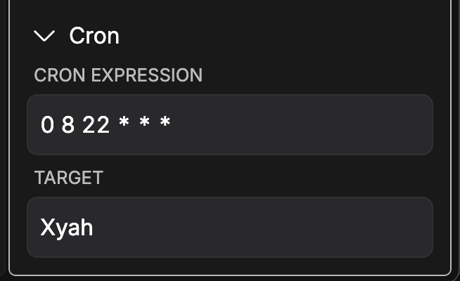

# bridge-plugin-cron
Cron-based triggers for Bridge. This plugin lets you schedule playout based on cron expressions.

## Table of contents
- [Installation](#installation)
- [How to use](#how-to-use)
  - [Enable a trigger](#enable-a-trigger)
  - [Disable a trigger](#disable-a-trigger)
- [FAQ](#faq)

## Installation
Download the latest release and put the whole (unzipped) folder inside of Bridge's plugin folder. Find the plugin directory by opening Bridge and going to `Plugins > Manage plugins` in the menu bar.

[Releases](https://github.com/axelboberg/bridge-plugin-cron/releases)

The resulting structure should look like the following:
```
- bridge plugin directory
    |- bridge-plugin-cron
        |- main.bundle.js
        |- package.json
```

1. Place the latest release in the plugin directory
2. Restart Bridge

## How to use



*The example in the screenshot above will trigger item with id 'Xyah' every day at 22:08 / 10:08 PM.*

This plugin provides a new item type, the CRON task. It can be added to the rundown like any other item and takes two custom inputs. A cron expression and a target. The cron expression should be valid cron expression, this plugin supports second precision. And the target should be a four character ID of another item that will be played any time the expression triggers.

**Note: In order for the trigger to be activated it will itself need to be played.**

### Enable a trigger
Play it like any other item.

### Disable a trigger
Stop it like any other item.

## FAQ

#### What happens if Bridge is closed?
Tasks are cancelled and will need to be played again at startup to be resumed.

#### My task isn't running?
You must play the task item for it to be enabled.

#### How do I update a task?
Simply change the item and play it again.
